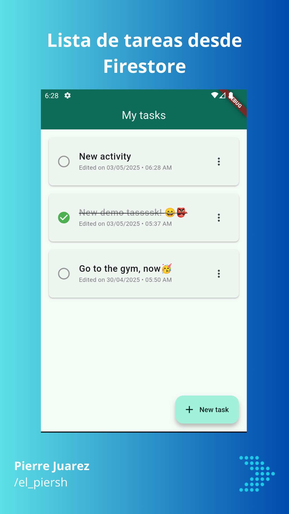
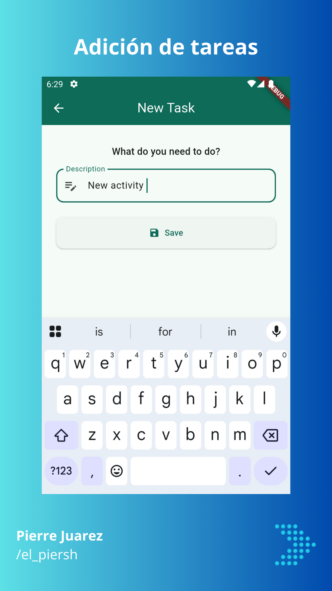
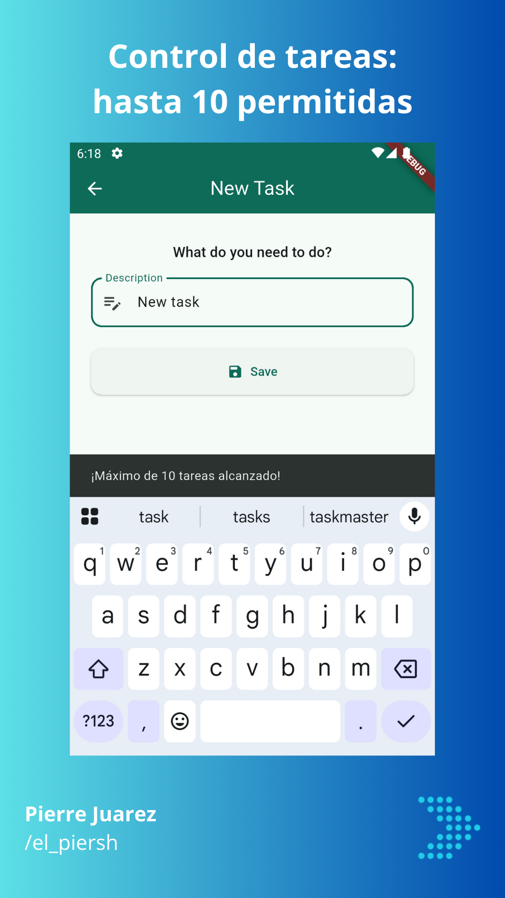
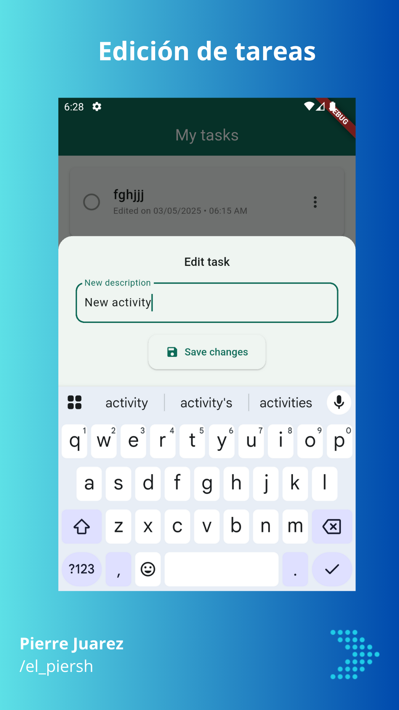
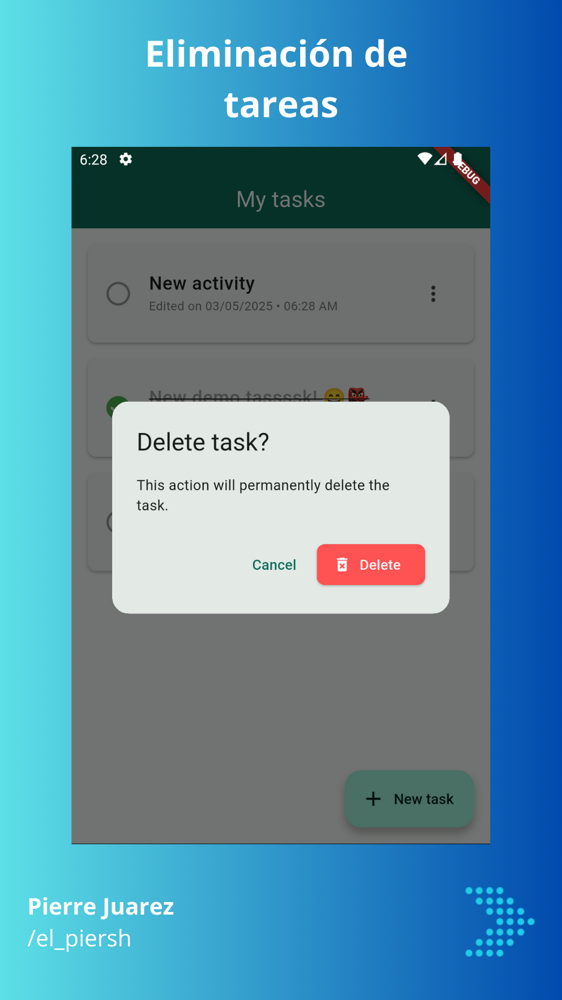

# 📝 To-Do App en Realtime (Flutter + Firestore)

Una lista de tareas moderna que **funciona en tiempo real**, hecha con **Flutter** y **Firebase Firestore**.  
¡Sin refrescar, sin esperas! Cambios instantáneos para que nunca pierdas el ritmo.

---


---

## 🚀 Features

- ✅ Agrega, edita y elimina tareas al instante (sin refrescar).
- ⚡ Actualización automática con Firestore en tiempo real.
- 🧠 Validación de máximo **10 tareas activas** para mantenerlo simple y sin desbordes.
- 💾 Persistencia 100% en Firestore.
- 🎨 UI limpia y responsiva con Flutter.
- 🧑‍💻 Código abierto y listo para producción o aprendizaje.

---

## 📸 Demo

| Slide 1                       | Slide 2                       | Slide 3                       |
| ----------------------------- | ----------------------------- | ----------------------------- |
|  |  |  |

| Slide 4                       | Slide 5                       | Slide 6                       |
| ----------------------------- | ----------------------------- | ----------------------------- |
|  |  |  |

> Todas las capturas están incluidas en la carpeta `assets/demo`.

---

## 🛠 Instalación

1. Clona el repositorio:

```bash
git clone https://github.com/pierre-juarez/to-do-firestore.git
```

2. Entra al proyecto:

```bash
cd to-do-firestore
```

3. Instala las dependencias:

```bash
flutter pub get
```

4. Asegúrate de tener configurado Firebase correctamente:

   - Agrega tu archivo `google-services.json` (Android) o `GoogleService-Info.plist` (iOS).
   - Revisa `firebase_options.dart` generado por FlutterFire CLI.

5. Corre la app:

```bash
flutter run
```

---

## 🙌 Contribuciones

Si deseas contribuir a este proyecto, por favor sigue estos pasos:

1. Haz un fork del repositorio.
2. Crea una nueva rama:

```bash
git checkout -b feature/nueva-caracteristica
```

3. Realiza tus cambios y haz un commit:

```bash
git commit -m 'Agrega nueva característica'
```

4. Sube tus cambios:

```bash
git push origin feature/nueva-caracteristica
```

5. Abre un Pull Request 🚀

---

## 👨‍💻 Créditos

Desarrollado con ♥️ por [Pierre Juarez](https://www.linkedin.com/in/pierre-juarez/) 😊

---
